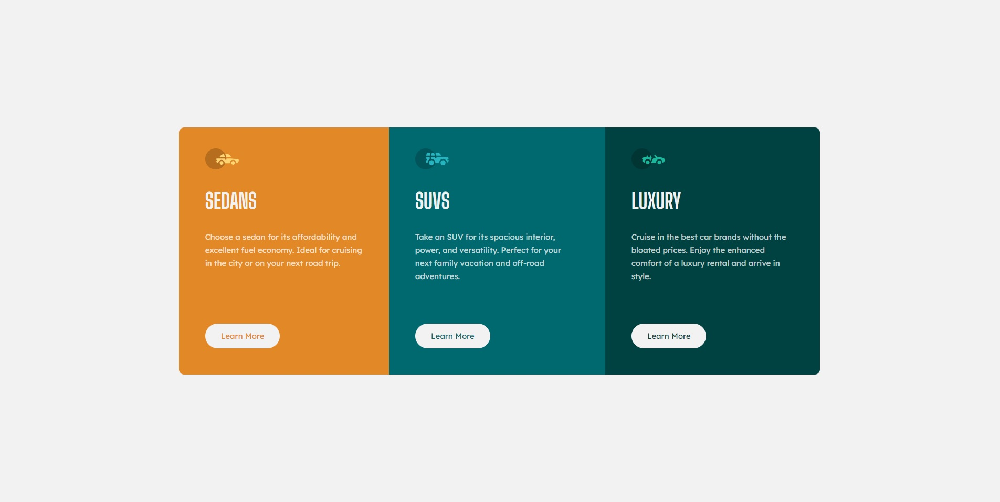

# Frontend Mentor - 3-column preview card component solution

This is a solution to the [3-column preview card component challenge on Frontend Mentor](https://www.frontendmentor.io/challenges/3column-preview-card-component-pH92eAR2-). Frontend Mentor challenges help you improve your coding skills by building realistic projects. 

## Table of contents

- [Overview](#overview)
  - [The challenge](#the-challenge)
  - [Screenshot](#screenshot)
  - [Links](#links)
- [My process](#my-process)
  - [Built with](#built-with)
  - [What I learned](#what-i-learned)
  - [Continued development](#continued-development)
- [Author](#author)

## Overview

### The challenge

Users should be able to:

- View the optimal layout depending on their device's screen size
- See hover states for interactive elements

### Screenshot




### Links

- Solution URL: [https://github.com/GSD3v08/3-column-preview-card](https://github.com/GSD3v08/3-column-preview-card)
- Live Site URL: [https://gsd3v08.github.io/3-column-preview-card/](https://gsd3v08.github.io/3-column-preview-card/)

## My process

### Built with

- Semantic HTML5 markup
- CSS custom properties
- Flexbox
- Mobile-first workflow

### What I learned

In this challenge I learn how to avoid buttons go up when try to resize the web. 
I fixed it adding the following and button does not move anymore. If you have a better alternative please let me know.

```css
.button{
    position: absolute;
    left: 50px;
    bottom: 40px;
    }
```

### Continued development

Keep learning about flexbox and responsive design.


## Author

- Frontend Mentor - [@GSD3v08](https://www.frontendmentor.io/profile/GSD3v08)